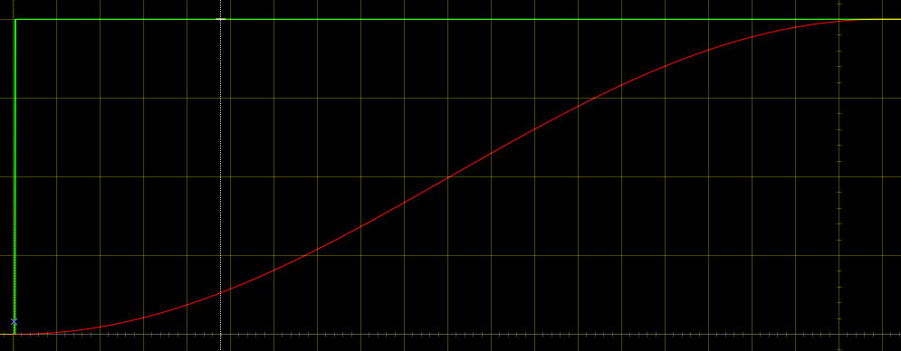

all the curves:
https://www.desmos.com/calculator/tjiyiyxmva

## What is this?

shapedSmoother is a smoother that allows you to define the shape of the step response in a formula.  
The formula currently in use is slice of a sine, called targetCurve in this dsp, and t(x) in desmos.  
If the input signal is a single step, say from 0 to 4, the output will fade from 0 to 4 in "attack" ms, in the shape of targetCurve.  

Green is the input, red is the output.
  
Using a slice of sine ensures that both the start and the end of the fade have zero speed.  
For now, we only consider the attack case; where the current input is bigger than the previous output, and we ignore the release case; where the current input is smaller than the previous output.  

## Goal

In [lamb-rs](https://github.com/magnetophon/lamb-rs) we use a curve that has a separate duration and shape for the attack and release.  
The user can change both the shapes and the durations.  
There, I use a brute force approach, whereas in this dsp, I'm well on my way to do it in a more elegant way, that is much lighter on the CPU. 

## Implementaiton

If all our inputs where semi-static like the single step example above, we could implement it as a simple crossfade.  
The controll signal would be based on a ramp from 0 to 1 over "attack" ms, that starts when "we are attacking".  
If we shape that ramp trough the target curve, we get the controll signal for our cross-fader.  
For the start of the crossfade, we take the input value we had before we started fading, and for the end, we take our new input value. 

This works fine if our input is a single step, but if the output value is already moving and we get a new input value the crossfade approach would lead to discontinuities in the output.  
  
So instead, we keep track of the previous output value and calculate what we need to add to it so that we keep the same step response.

To find out how to calculate this delta value, let's go back to our "single step input" example and assume we are fading from 0 to 1.  
In this case, the delta value is the ramp we used in the crossfade, fed into the derivative of the target curve.  
To generalize for a total step size different from 1, we multiply by the total step size.
This approach will get rid of discontinuities in the output, since it is now defined as the previous output plus a small step.  
The output is not smooth yet though: when the input value changes while the ramp is already going, we get a sudden change in direction of the output.  
  
Depending on how we define the total step, we get either the above behavior, or the output plateaus off before we reach the target; more on that later.
In any case, the output will not be smooth.

To make the output smooth, we can choose a new place in the ramp so that our speed matches the speed we had previously.  
If we'd do that, and our input is a single step, the ramp would stay stuck at a fixed value, so our crossfade would progress at a contant speed, instead of the curve we want.  
To fix that, we take the phase at the matching speed, and add a step along the ramp.  
So for a single step input, we get exactly the same saw-shaped ramp that we where using before, but if the input changes while fading, we get a new starting place for the ramp that ensures we keep going at a similar speed as the one we had in the previous sample.

We now have a fade that follows the curve we want for a single step, and when it encounters a new input value while already fading, it will adjust it's phase so that the curve stays smooth.  
This reveals our next challenge: when we are in the process of a big step, and we get a new input that is slightly higher, the fade for the new input is too quick.  
  
In the above diagram, the input is again green, the output red, and the phase blue.
Note that the phase is in a different scale then the signals.

The second part of the fade is too fast, because in this example, we calculate the total step as the difference between our new input value and the value we had when we first started fading.  
So for the big step, we get the correct values, because our total step is 6, but for the small step, we get a total step of 7, leading to taking too big steps each sample, so we reach te target too quick.
We should be using a total step of slightly more than 1, namely: the difference between the previous output and the new inout value, at the point where the small step starts.
So we dynamically calculate the total step based on the previous output, the previous phase and the new input.

